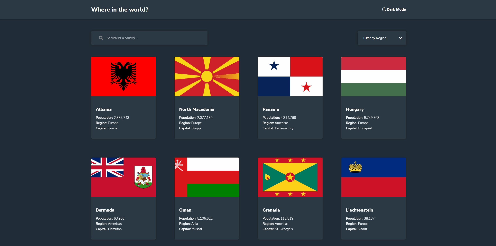

# Frontend Mentor - REST Countries API with color theme switcher solution

This is a solution to the [REST Countries API with color theme switcher challenge on Frontend Mentor](https://www.frontendmentor.io/challenges/rest-countries-api-with-color-theme-switcher-5cacc469fec04111f7b848ca). Frontend Mentor challenges help you improve your coding skills by building realistic projects. 

## Table of contents

- [Overview](#overview)
  - [The challenge](#the-challenge)
  - [Screenshot](#screenshot)
  - [Links](#links)
- [My process](#my-process)
  - [Built with](#built-with)
  - [What I learned](#what-i-learned)
- [Author](#author)

## Overview

### The challenge

Users should be able to:

- See all countries from the API on the homepage
- Search for a country using an `input` field
- Filter countries by region
- Click on a country to see more detailed information on a separate page
- Click through to the border countries on the detail page
- Toggle the color scheme between light and dark mode *(optional)*

### Screenshot

### Links

- Solution URL: [Frontend Mentor](https://www.frontendmentor.io/solutions/built-with-vanilla-javascript-webpack-5-sass-postcss-and-babel-cERdHPl-e)
- Live Site URL: [Netlify](https://andro-rest-countries.netlify.app/)

### Built with

- MVC Architecture & Vanilla JavaScript
- HTML5
- Sass
- PostCSS
- Babel
- Webpack

### What I learned

This project was a really good learning opportunity for me to really see how you can build a project with a certain architecture combined with vanilla JS and Webpack 5.
I learned a lot how easy after initial setup to work with Webpack+JS, PostCSS, Babel. I could built it with React or any other framework but wanted to test my JS skills to the next level.
I love working with REST Apis and JSON data.

## Author

- Website - [Andras Kelemen](https://www.your-site.com)
- Frontend Mentor - [@androgitai](https://www.frontendmentor.io/profile/androgitai)
- Twitter - [@AndrasKelemen3](https://www.twitter.com/AndrasKelemen3)

